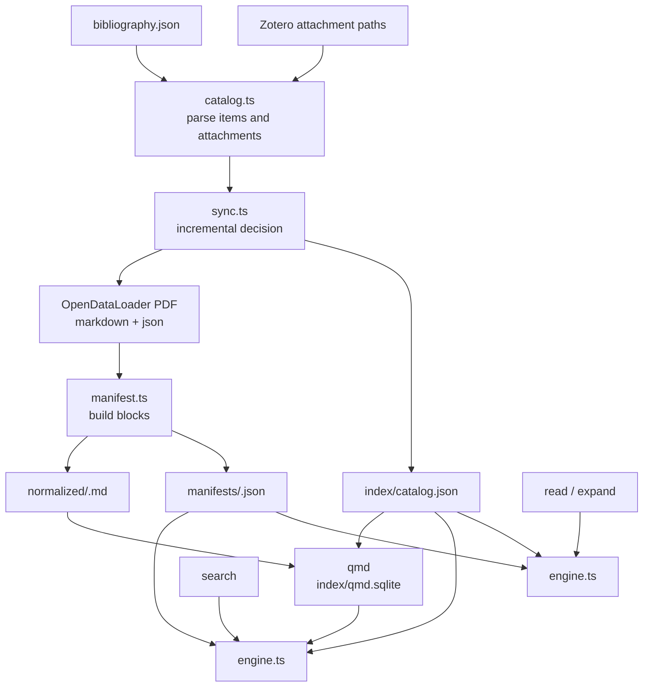

# zotlit

[](https://github.com/TomBener/zotlit/actions/workflows/lint.yml)
[](https://github.com/TomBener/zotlit/actions/workflows/release.yml)

`zotlit` is a Zotero literature search CLI for AI agents.

It uses:

- a Zotero-exported bibliography JSON
- attachment paths recorded in that bibliography

Current scope:

- `PDF` only
- local indexing and search
- stable follow-up reads from local manifests

Main commands:

- `sync`: build or refresh the local index
- `search`: search indexed PDFs
- `metadata`: search bibliography metadata
- `read` / `expand`: read blocks and local context after a hit

It does not currently:

- process EPUB
- sync notes or annotations
- read the DEVONthink database directly

## Implementation

`zotlit` is built on two main components:

- [OpenDataLoader PDF](https://github.com/opendataloader-project/opendataloader-pdf)
  for PDF extraction into Markdown and structured JSON
- [qmd](https://github.com/tobi/qmd)
  for default semantic search
- [Tantivy](https://github.com/quickwit-oss/tantivy)
  for lexical exact search

High-level flow:



## Requirements

- Node.js `22+`
- JDK `11+`

Notes:

- `sync` uses Java during PDF extraction
- qmd may prepare local models on first use

## Default Paths

Default configuration:

- bibliography: `~/Library/CloudStorage/Dropbox/bibliography/bibliography.json`
- attachments root: `~/Library/Mobile Documents/com~apple~CloudDocs/Zotero`
- data dir: `~/Library/Mobile Documents/com~apple~CloudDocs/Zotlit`
- config file: `~/.zotlit/config.json`

Example config:

```json
{
  "bibliographyJsonPath": "~/Library/CloudStorage/Dropbox/bibliography/bibliography.json",
  "attachmentsRoot": "~/Library/Mobile Documents/com~apple~CloudDocs/Zotero",
  "dataDir": "~/Library/Mobile Documents/com~apple~CloudDocs/Zotlit"
}
```

If you want to set a qmd embedding model:

```json
{
  "qmdEmbedModel": "<model-uri>"
}
```

The main CLI help does not list these configuration-oriented overrides. They are read from `~/.zotlit/config.json` by default.

## Release And Distribution

This repository includes a GitHub Actions release workflow that packages a tagged build as `zotlit-<version>.tgz`.

For now, the most direct way to work with the CLI is still from source:

```bash
npm install
npm run build
node dist/cli.js help
```

## Command Overview

```bash
zotlit sync [--attachments-root <path>]
zotlit status
zotlit version
zotlit search "<text>" [--exact] [--limit <n>] [--min-score <n>] [--rerank | --no-rerank]
zotlit metadata "<text>" [--limit <n>] [--field <field>] [--has-pdf]
zotlit read (--file <path> | --item-key <key>) [--offset-block <n>] [--limit-blocks <n>]
zotlit expand --file <path> --block-start <n> [--block-end <n>] [--radius <n>]
```

## Usage

### 1. `sync`

`sync` reloads the bibliography, extracts changed PDFs, writes local index files, rebuilds the lexical exact index, and updates the qmd search index.

What it does:

1. Reads the bibliography JSON
2. Filters attachments under `attachmentsRoot`
3. Keeps `.pdf` attachments only
4. Uses `size`, `mtime`, and existing index files to decide whether an attachment needs to be rebuilt
5. Regenerates:
   - `normalized/<docKey>.md`
   - `manifests/<docKey>.json`
   - `index/catalog.json`
6. Rebuilds `index/tantivy/`
7. Updates the qmd index

Common commands:

```bash
zotlit sync
zotlit sync --attachments-root "/path/to/zotero/subfolder"
```

Notes:

- `sync` does not accept a positional folder path
- use `--attachments-root` if you want to limit the run to a Zotero subfolder
- temporary extraction files are written to the system temp directory, not `dataDir/.tmp`

After extraction, `sync` also prints two stage messages:

- `Sync: rebuilding exact search index...`
- `Sync: updating search index...`
- `Sync: generating embeddings...`

The first stage rebuilds the lexical exact index. The later stages are qmd index work, not a hang.

### 2. `status`

`status` shows the current index state and local paths.

```bash
zotlit status
```

Main sections in the output:

- `counts`: total, ready, missing, unsupported, and error attachments
- `paths`: `normalized/`, `manifests/`, `index/`, `index/tantivy/`, `qmd.sqlite`, and `catalog.json`
- `qmd`: current qmd index state

Example:

```json
{
  "ok": true,
  "data": {
    "counts": {
      "totalAttachments": 11,
      "readyAttachments": 11
    },
    "paths": {
      "normalizedDir": "~/Library/Mobile Documents/com~apple~CloudDocs/Zotlit/normalized",
      "tantivyDir": "~/Library/Mobile Documents/com~apple~CloudDocs/Zotlit/index/tantivy",
      "qmdDbPath": "~/Library/Mobile Documents/com~apple~CloudDocs/Zotlit/index/qmd.sqlite"
    },
    "qmd": {
      "totalDocuments": 11,
      "hasVectorIndex": true
    }
  }
}
```

### 3. `search`

`search` runs against indexed PDFs.

```bash
zotlit search "state-owned enterprise governance"
zotlit search "dangwei shuji" --exact
zotlit search "state-owned enterprise governance" --limit 5
zotlit search "state-owned enterprise governance" --min-score 0.4
zotlit search "how do party secretaries shape SOE governance" --rerank
zotlit search "industrial policy" --no-rerank
```

Notes:

- search text is positional; `--query` is not supported
- `--exact` enables lexical exact search
- `--rerank` and `--no-rerank` only apply to the default search mode
- `--exact` cannot be combined with `--rerank`
- default reranking follows qmd's default behavior unless you override it

#### Default Search

Default `search` works like this:

1. qmd runs its unified search on `normalized/*.md`
2. qmd returns candidate documents plus the best chunk position
3. `zotlit` maps `bestChunkPos` back to manifest blocks
4. `zotlit` builds `passage`, `blockStart`, and `blockEnd`
5. purely reference-like hits get a small score penalty

#### `--exact`

`--exact` uses a dedicated Tantivy-based lexical index. It does not use qmd.

Flow:

1. search the local Tantivy exact index built from manifest text
2. map candidates back to `docKey`
3. use the local manifest to find the smallest matching block range

That means:

- default `search` is relevance-oriented
- `search --exact` is literal and lexical

Example output:

```json
{
  "ok": true,
  "data": {
    "results": [
      {
        "itemKey": "KG326EEI",
        "citationKey": "chan2022",
        "title": "Inside China’s state-owned enterprises: managed competition through a multi-level structure",
        "authors": ["Chan Kyle"],
        "year": "2022",
        "file": "~/Library/Mobile Documents/com~apple~CloudDocs/Zotero/attachment.pdf",
        "passage": "Within CREC’s and CRCC’s multi-level structure, ... party secretary (dangwei shuji) ...",
        "blockStart": 133,
        "blockEnd": 133,
        "score": 0.6807
      }
    ]
  }
}
```

#### Result Fields

The most important fields in a `search` result are:

- `itemKey`
  Zotero item key
- `citationKey`
  display-oriented citation key; not guaranteed to be stable
- `file`
  attachment path
- `passage`
  matched text passage
- `blockStart` / `blockEnd`
  matched local block range
- `score`
  qmd score plus a small amount of `zotlit` post-processing

### 4. `metadata`

`metadata` searches Zotero bibliography metadata directly from `bibliography.json`.

```bash
zotlit metadata "American Journal of Political Science"
zotlit metadata "Kenneth Benoit" --field author
zotlit metadata "large language models" --field title --field abstract
zotlit metadata "political economy" --has-pdf
```

Notes:

- metadata search text is positional; `--query` is not supported
- `metadata` does not require `sync`
- `metadata` returns up to 20 results by default; use `--limit` to change that
- `--field` can be repeated and supports `title`, `author`, `year`, `abstract`, `journal`, and `publisher`
- `journal` only applies to journal-like item types
- `publisher` only applies to `book` and `chapter`
- `--has-pdf` keeps only records with at least one supported PDF attachment path

Example output:

```json
{
  "ok": true,
  "data": {
    "results": [
      {
        "itemKey": "YTSBBC7P",
        "citationKey": "benoit2026ull",
        "type": "article-journal",
        "title": "Using large language models to analyze political texts through natural language understanding",
        "authors": ["Benoit Kenneth"],
        "year": "2026",
        "abstract": "Abstract ... We conclude with a discussion of the profound implications of modern LLMs for political text analysis.",
        "hasSupportedPdf": true,
        "supportedPdfFiles": [
          "~/Library/Mobile Documents/com~apple~CloudDocs/Zotero/AI/journalArticle/Benoit - 2026 - Using large language models to analyze political texts through natural language understanding.pdf"
        ],
        "matchedFields": ["journal"],
        "score": 4,
        "journal": "American Journal of Political Science"
      }
    ]
  }
}
```

### 5. `read`

`read` does not use qmd. It reads blocks directly from the local manifest.

```bash
zotlit read --item-key KG326EEI
zotlit read --file "~/Library/.../paper.pdf" --offset-block 20 --limit-blocks 10
```

Notes:

- use either `--file` or `--item-key`
- if one `itemKey` maps to multiple indexed attachments, `read --item-key` will fail with a conflict
- the defaults are `offsetBlock = 0` and `limitBlocks = 20`

Example output:

```json
{
  "ok": true,
  "data": {
    "itemKey": "KG326EEI",
    "title": "Inside China’s state-owned enterprises: managed competition through a multi-level structure",
    "totalBlocks": 269,
    "blocks": [
      {
        "blockIndex": 0,
        "blockType": "paragraph",
        "text": "Article",
        "pageStart": 1,
        "pageEnd": 1
      }
    ]
  }
}
```

### 6. `expand`

`expand` returns local context around a hit or a known block range. It also does not depend on qmd.

```bash
zotlit expand --file "~/Library/.../paper.pdf" --block-start 133
zotlit expand --file "~/Library/.../paper.pdf" --block-start 133 --block-end 133 --radius 1
```

Notes:

- `expand` currently requires `--file`
- `--block-start` is required
- `--block-end` defaults to `block-start`
- the default `radius` is `2`

Example output:

```json
{
  "ok": true,
  "data": {
    "contextStart": 132,
    "contextEnd": 134,
    "blockStart": 133,
    "blockEnd": 133,
    "passage": "Within CREC’s and CRCC’s multi-level structure, ...",
    "blocks": [
      {
        "blockIndex": 132,
        "blockType": "heading",
        "text": "Managerial appointments and career paths"
      },
      {
        "blockIndex": 133,
        "blockType": "paragraph",
        "text": "Within CREC’s and CRCC’s multi-level structure, ..."
      }
    ]
  }
}
```

## Index Layout

By default, the persistent index lives under:

- `~/Library/Mobile Documents/com~apple~CloudDocs/Zotlit`

Directory layout:

```text
Zotlit/
  normalized/
    <docKey>.md
  manifests/
    <docKey>.json
  index/
    catalog.json
    qmd.sqlite
```

What each file is for:

- `normalized/<docKey>.md`
  normalized text used by qmd for indexing and search
- `manifests/<docKey>.json`
  structured local text used by `search` mapping, `read`, and `expand`
- `index/catalog.json`
  attachment catalog and path mapping
- `index/qmd.sqlite`
  qmd's local search database

### What Is `docKey`?

- `itemKey` is the Zotero item identifier
- `docKey` is `zotlit`'s attachment-level identifier

Current implementation:

- `docKey = sha1(filePath)`

So if an attachment path changes, the `docKey` changes too.

That means:

- `docKey` is path-based, not content-based
- renaming or moving an attachment behaves like "old path removed + new path added"

## Scope And Limits

Current `zotlit` processing only includes attachments that meet all of these conditions:

1. they appear in the bibliography `file` field
2. their path is under `attachmentsRoot`
3. their extension is `.pdf`

So `zotlit` does not crawl the attachments directory blindly. It processes the PDF attachments referenced by the bibliography.

## Notes

- `passage` comes from extracted text blocks, not from the PDF's visual layout
- blocks are usually close to headings, paragraphs, or list items, but they do not always match the PDF's visual paragraph boundaries exactly
- `read` and `expand` depend on manifests, so they can stay stable even if the search backend changes later

## Development

```bash
npm run check
npm run build
```

Common local commands:

```bash
node dist/cli.js sync
node dist/cli.js status
node dist/cli.js search "aging in China"
node dist/cli.js read --item-key KG326EEI
node dist/cli.js expand --file "~/Library/.../paper.pdf" --block-start 10 --radius 2
```
